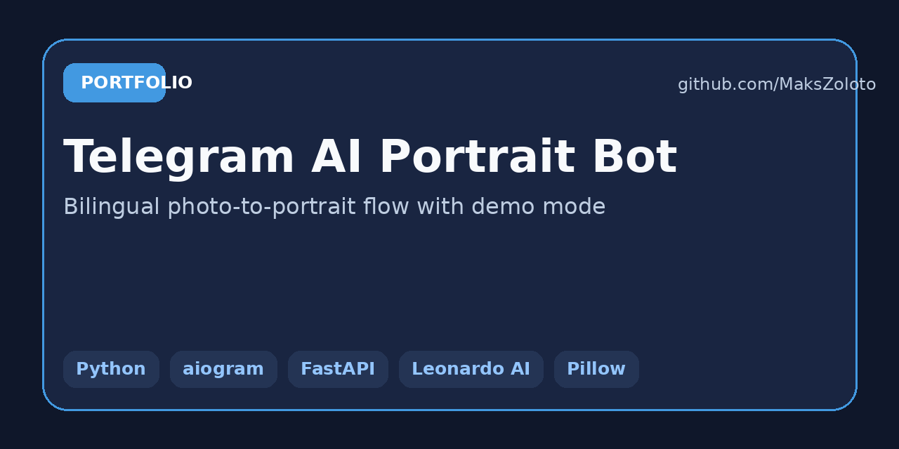
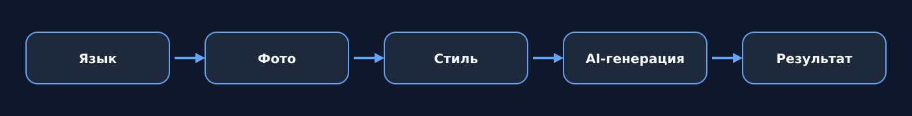
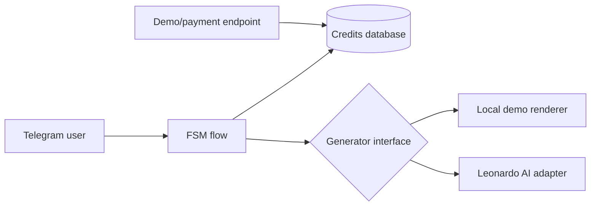

# Telegram AI Portrait Bot

Двуязычный Telegram-бот для генерации стилизованных портретов: пользователь
выбирает язык, загружает фотографию, выбирает стиль и получает результат.
Проект включает баланс генераций и демонстрационный сценарий пополнения.



## Возможности

- русский и английский интерфейс;
- загрузка пользовательского фото;
- выбор визуального стиля;
- генерация результата;
- баланс и учёт использованных генераций;
- демонстрационное пополнение;
- FastAPI health/payment endpoints;
- локальный demo-режим без внешнего AI API;
- опциональный адаптер Leonardo AI.



## Почему demo-режим полезен

Публичный репозиторий запускается без платного API:

1. Фото обрабатывается локально через Pillow.
2. К изображению применяется визуальный preset.
3. Результат маркируется `DEMO`.
4. Пользовательский файл удаляется после обработки.

Это позволяет показать весь продуктовый сценарий без публикации ключей и
без расходов на генерацию.

## Архитектура



## Запуск

API без Telegram:

```bash
cp .env.example .env
docker compose up --build
```

Откройте `http://localhost:8090/docs`.

Полный Telegram-сценарий:

```env
BOT_TOKEN=your_token
RUN_BOT=true
PUBLIC_BASE_URL=https://your-public-domain.example
```

## Leonardo AI

Для подключения внешней генерации:

```env
DEMO_MODE=false
LEONARDO_API_KEY=your_key
LEONARDO_MODEL_ID=your_model_id
```

Перед production-запуском контракт внешнего API необходимо сверить с
текущей документацией провайдера, добавить очередь задач, ограничения
размера фото и правила хранения пользовательских данных.

## Проверка

```bash
pip install -e ".[dev]"
ruff check .
pytest -q
```

## Конфиденциальность

Исходные фотографии временно сохраняются только на время обработки и
удаляются после успешной генерации. Публичный проект не содержит фото
клиентов, балансы пользователей, токены, ключи AI или платёжные реквизиты.

## Автор

**Максим Золотухин** — AI-интеграции, Telegram-боты и автоматизация пользовательских сценариев.

Контакт: [maksim.zolotuhin@inbox.ru](mailto:maksim.zolotuhin@inbox.ru)
